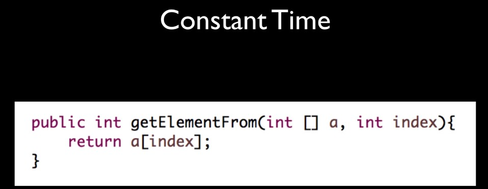
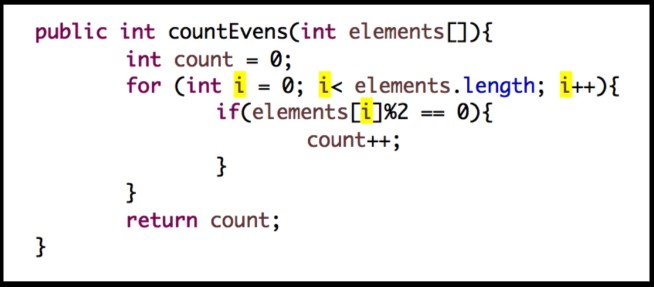
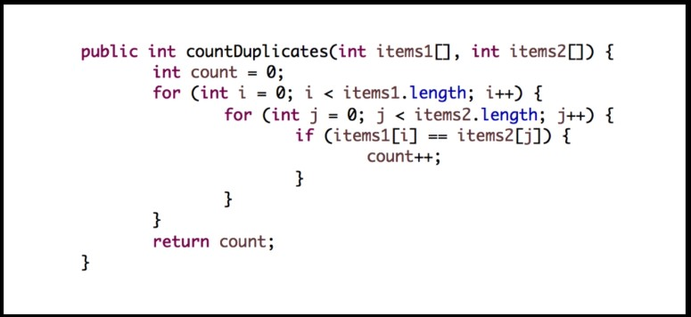
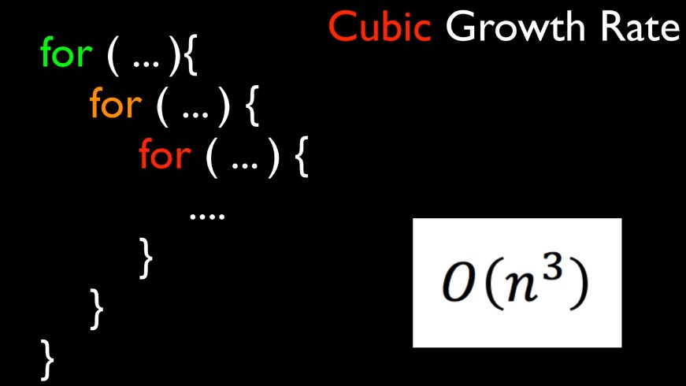
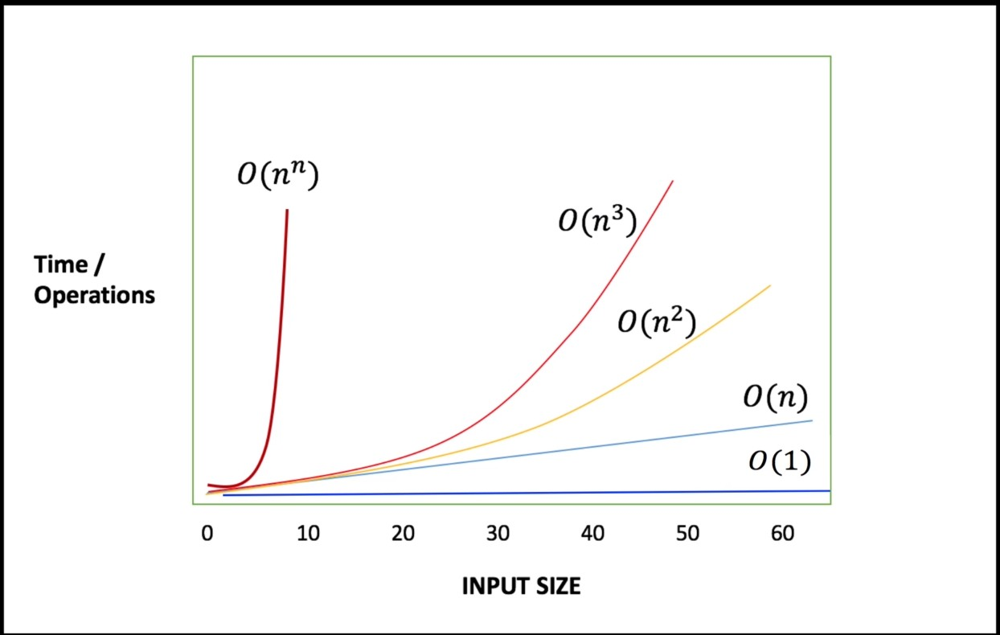

#### Big O Notations:
* [Big O notation is a mathematical notation that describes the limiting behavior of a function when the argument tends towards a particular value or infinity.](https://en.wikipedia.org/wiki/Big_O_notation#:~:text=Big%20O%20notation%20is%20a,a%20particular%20value%20or%20infinity.)
###### Algorithm:
* `Algorithm` is nothing but instructions to the computer for how to solve a particular problem.
###### Why we need Big O notations :grey_question:
* To Calculate time complexity with respect to input of `Algorithm` we need `Big O notaions`.
###### Big O notation growth rates:
- [x] Constant Growth Rate
- [x] Linear Growth Rate
- [x] Quadratic Growth Rate
- [x] Cubic Growth Rate
- [x] Exponential Growth Rate
- - - -
##### Constant Growth Rate:
* Suppose we pass list, and it's index to some method and return the element from list.

##### Linear Growth Rate:
* Suppose we have list/array of integers, and we need to calculate even numbers:

* Algorithms that iterate collection/all the elements once are typically Linear.
* In short if we pass 100 elements, and it will iterate 100 time.
* Big O notation is `O(n)`

##### Quadratic Growth Rate:
* If any algorithm have looped in a loop (max two) called `Quadratic Growth Rate`.
* Big O notation is `O(n^2)` (it's n square)
* For example if we have two lists and each have 10 record and if we need to use `Quadratic` algorithm
  it will iterate max `10 x 10 = 100` times.
* `Quadratic growth rate` algorithm:

##### Cubic Growth Rate:
* If we have 3 loops like loop have another loop that also have another loop.
* For example if we have three lists and each have 10 record and if we need to use `Cubic` algorithm
  it will iterate max `10 x 10 x 10 = 300` times.
* Big O notation is `O(n^3)`
* `Cubic growth rate` algorithm:

##### Exponential Growth Rate:
* If we don't know how many loops will resolve our problem called `Exponential growth rate`.
* It's the worst algorithm approach
* `Brute force algorithm` is one of the examples of Exponential growth rate.
* Big O notation is `O(n^n)`
###### Constant, Linear, Quadratic, Cubic and Exponential Big O Notation graph

- - - -